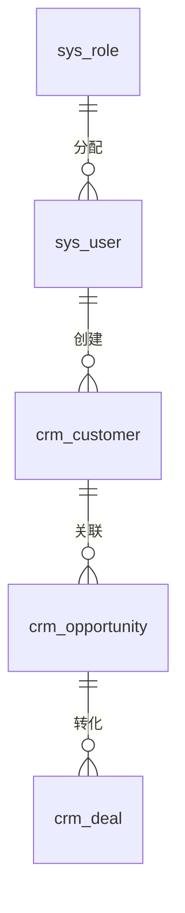

# Plan 技术实施计划

---

## 1. 架构设计

### 分层架构

```
前端层 → API 网关层 → Controller 层 → Service 层 → Repository 层 → Entity 层 → 数据层
```

### 职责划分

- **Controller**：接收请求、参数校验、统一响应
- **Service**：业务逻辑、事务管理、缓存管理
- **Repository**：数据访问、SQL 查询
- **Entity**：数据库表映射

---

## 2. 数据库设计

### ER 图



### 核心表结构

1. **sys_user**（用户表）
2. **sys_role**（角色表）
3. **crm_customer**（客户表）
4. **crm_opportunity**（商机表）
5. **crm_deal**（销售机会表）
6. **crm_activity**（跟进记录表）
7. **crm_report**（报表统计表）
8. **crm_config**（系统配置表）

---

## 3. API 设计

### 统一响应格式

```java
public class Result<T> {
    private Integer code;
    private String message;
    private T data;
    private Long timestamp;
}
```

### 核心 API 端点

| 方法 | 路径 | 说明 |
|------|------|------|
| GET | /api/v1/customers | 客户列表 |
| POST | /api/v1/customers | 创建客户 |
| GET | /api/v1/opportunities | 商机列表 |
| GET | /api/v1/opportunities/stats | 商机统计 |

---

## 4. Redis 缓存策略

### 缓存 Key 设计

- 用户信息：`crm:user:{userId}`（TTL: 2小时）
- 客户列表：`crm:customer:list:{page}:{size}`（TTL: 30分钟）
- 报表数据：`crm:report:{type}:{date}`（TTL: 1小时）

### 缓存更新策略

先更新数据库，再删除缓存。

---

## 5. 项目依赖

### 后端（pom.xml）

- Spring Boot 3.2.0
- MyBatis-Plus 3.5.5
- MySQL 8.0
- Redis 7.0

### 前端（package.json）

- React 18.2.0
- TypeScript 5.0+
- Vite 5.0+
- Tailwind CSS 3.4.0

---

## 6. 前端国际化（i18n）设计

### 架构

- 使用 `react-i18next` 实现多语言支持
- 中文资源：`frontend/src/i18n/zh-CN.ts`
- 英文资源：`frontend/src/i18n/en.ts`
- 顶层命名空间：`app`, `menu`, `login`, `home`, `breadcrumb`, `common`, `pages`

### 命名空间结构

| 命名空间 | 说明 | 示例 key |
|----------|------|----------|
| `app` | 应用全局 | `app.title`, `app.logout` |
| `menu` | 菜单文案 | `menu.home`, `menu.customer`, `menu.atRisk` |
| `common` | 公共文案 | `common.button.save`, `common.message.success` |
| `pages.xxx` | 页面级文案 | `pages.customer.list.title`, `pages.lead.list.total` |

### `pages` 命名空间（59 个页面子命名空间）

包含所有业务页面的翻译：`customer`, `product`, `opportunity`, `contract`, `quote`, `ticket`, `lead`, `contact`, `task`, `approval`, `order`, `userManagement`, `dashboard`, `reportCenter`, `announcement`, `contactsCard`, `commentSection`, `followUpTimeline`, `notificationCenter`, `surveyBlock`, `signSection`, `signaturePad`, `installPrompt`, `leadConvertModal`, `errorBoundary`, `taskCalendar`, `orderDetail`, `quoteList`, `invoiceList`, `breadcrumbGroup`, `auditLog`, `exportCenter`, `changePassword`, `salesOpportunity`, `teamLeaderboard`, `suggestionCenter`, `recycleBin`, `roleList`, `searchResult`, `duplicateMerge`, `departmentList`, `atRiskCustomers`, `personalCenter`, `usageMap`, `notFound`, `currency`, `approvalFlow`, `slaPolicy`, `contractTemplate`, `contractRenewal`, `customField`, `customObject`, `openPlatform`, `integrationHub`, `workflowRule`, `tagList`, `marketing`, `landing`, `emailUnsubscribe`, `knowledge`, `slaCalendar`

### 组件命名空间

以下组件使用 `pages.xxx` 命名空间（与页面同级）：

| 命名空间 | 组件文件 | 说明 |
|----------|----------|------|
| `announcement` | `AnnouncementCard.tsx` | 公告卡片 |
| `contactsCard` | `ContactsCard.tsx` | 联系人卡片 |
| `commentSection` | `CommentSection.tsx` | 评论区域 |
| `followUpTimeline` | `FollowUpTimeline.tsx` | 跟进时间线 |
| `notificationCenter` | `NotificationCenter.tsx` | 通知中心 |
| `surveyBlock` | `SurveyBlock.tsx` | 问卷区块 |
| `signSection` | `SignSection.tsx` | 签署区域 |
| `signaturePad` | `SignaturePad.tsx` | 签名板 |
| `installPrompt` | `InstallPrompt.tsx` | 安装提示 |
| `leadConvertModal` | `LeadConvertModal.tsx` | 线索转化弹窗 |

### 使用规范

1. 页面组件使用 `t('pages.xxx.yyy')` 格式
2. 公共文案使用 `t('common.xxx')` 格式
3. 菜单文案使用 `t('menu.xxx')` 格式
4. 所有 `t()` 调用的 key 必须在 `zh-CN.ts` 和 `en.ts` 中均有定义

### 维护记录

| 日期 | 变更内容 |
|------|----------|
| 2025-01-XX | 补充 `pages.lead.list` 缺失的 `total`, `newLeads`, `working` |
| 2025-01-XX | 补充 `pages.contract.list` 缺失的 `total`, `totalAmount`, `effective`, `pending` |
| 2025-01-XX | 补充 `pages.opportunity.list` 缺失的 `total`, `totalAmount`, `emptyStage`, `kanbanView`, `listView` |
| 2025-01-XX | 补充 `pages.order.list` 缺失的 `total`, `planTotal`, `pending`, `partial`, `paid` |
| 2025-01-XX | 补充 `pages.product.list` 缺失的 `total`, `active`, `inactive` |
| 2025-01-XX | 补充 `pages.customer.detail` 缺失的 `tabBasic`, `tabOverview`, `tabTags`, `totalContract` |
| 2025-01-XX | 补充 `pages.customField` 缺失的 `fieldEntity*`, `fieldType*` |
| 2025-01-XX | 新增 `pages.fieldPermission` 完整命名空间（22 个 key） |
| 2025-01-XX | 补充 `pages.openPlatform` 缺失的 `enable`, `disable`, `delete` |
| 2025-01-XX | 补充 `pages.taskCalendar` 缺失的 `colAction` |
| 2025-01-XX | 补充 `pages.workflowRule` 缺失的 `formTagExtra` |
| 2025-01-XX | 补充 `pages.approvalFlow` 缺失的 `amountCondition` |
| 2025-01-XX | 修正 `BreadcrumbNav` 中 `menu.atRiskCustomers` → `menu.atRisk` |
| 2025-01-XX | 修正 `CustomerListPage` 中 `message.xxx` → `common.message.xxx`（4 处） |
| 2025-01-XX | 补充 `pages.dashboard.todo` (en.ts) 缺失的 `deadline`, `mockApproval`, `mockFollowup`, `mockTask` |

### 表单布局规范

#### Modal 表单

| 表单字段数 | Modal 宽度 | 列布局 | labelCol |
|-----------|-----------|--------|----------|
| 1-3 个 | 480-520px | 单列（layout="vertical"） | - |
| 4-6 个 | 640-720px | 2 列（Col span={12}） | flex: '100px' |
| 7+ 个 | 720-800px | 2 列（Col span={12}） | flex: '80-100px' |

#### 防止换行规则

1. **全局 CSS**（`index.css`）：
   - `Form.Item` 在 `Row/Col` 内 `marginBottom: 16px`，最后一项 `0`
   - 输入框/Select/标签强制 `white-space: nowrap` + `text-overflow: ellipsis`
   - Modal 内 `Col` 限制 `max-width: 100%`
   - 长标签截断而非换行

2. **组件内联**：`Col span={12}` 内的 `Form.Item` 必须加 `style={{ marginBottom: 0 }}`

3. **多行文本域**：例外允许 `white-space: pre-wrap` 换行

#### 已修复的表单文件

| 文件 | Modal 宽度 | 列数 |
|------|-----------|------|
| CustomerListPage | 640→720px | 2 |
| LeadListPage | 640→720px | 2 |
| ContactListPage | 640→720px | 2 |
| OrderListPage | 720→760px | 2 |
| ContractListPage | 720→760px | 2 |
| TaskListPage | 640→720px | 2 |
| TicketListPage | 640→720px | 2 |
| QuoteListPage | 760→800px | 2 |
| SalesOpportunityListPage | 640→720px | 2 |
| OpportunityListPage | 640→720px | 2 |
| WorkflowRuleListPage | 640→720px | 2 |
| CampaignListPage | 640→720px | 2 |
| EmailTemplatePage | 680→720px | 2 |
| SegmentListPage | 680→720px | 2 |
| ProductListPage | 640→720px | 2 |

---

## 7. 下一步

阅读 [06-Tasks任务分解](06-Tasks任务分解.md)。
