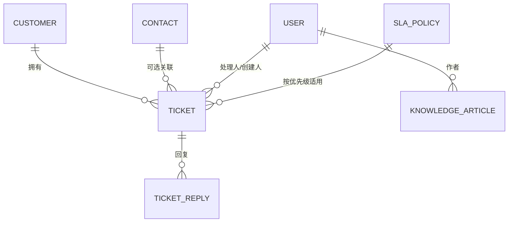

# 数据模型：客户服务模块

**Branch**: `015-customer-service` | **Date**: 2026-08-22

## 实体总览

## 1. ticket（工单）

| 列 | 类型 | 约束 | 说明 |
|---|---|---|---|
| id | BIGINT | PK, AUTO | |
| customer_id | BIGINT | NOT NULL, FK→customer | 关联客户（必填） |
| contact_id | BIGINT | NULL, FK→contact | 关联联系人（可选） |
| title | VARCHAR(200) | NOT NULL | 标题 |
| description | TEXT | NULL | 问题描述 |
| priority | VARCHAR(20) | NOT NULL | LOW/MEDIUM/HIGH/URGENT |
| status | VARCHAR(20) | NOT NULL | OPEN/IN_PROGRESS/RESOLVED/CLOSED，默认 OPEN |
| assignee_id | BIGINT | NULL, FK→user | 处理人 |
| sla_respond_deadline | DATETIME | NULL | SLA 响应到期（无策略=null） |
| sla_resolve_deadline | DATETIME | NULL | SLA 解决到期（无策略=null） |
| sla_status | VARCHAR(20) | NULL | NORMAL/WARNING/OVERDUE（按需刷新） |
| remark | VARCHAR(500) | NULL | 备注 |
| deleted | TINYINT | NOT NULL DEFAULT 0 | 逻辑删除（BaseEntity） |
| version | INT | NOT NULL DEFAULT 0 | 乐观锁（BaseEntity） |
| created_by | BIGINT | NULL | 创建人（BaseEntity） |
| created_at | DATETIME | NOT NULL | （BaseEntity） |
| updated_at | DATETIME | NOT NULL | （BaseEntity） |

索引：`idx_ticket_status`（status）、`idx_ticket_assignee`（assignee_id）、`idx_ticket_customer`（customer_id）。

状态流转：`OPEN → IN_PROGRESS → RESOLVED → CLOSED`（单向；CLOSED 不可回退；RESOLVED 不可再转 IN_PROGRESS 之外的任何状态——RESOLVED→CLOSED 允许）。

## 2. ticket_reply（工单回复）

| 列 | 类型 | 约束 | 说明 |
|---|---|---|---|
| id | BIGINT | PK, AUTO | |
| ticket_id | BIGINT | NOT NULL, FK→ticket | 所属工单 |
| replier_id | BIGINT | NOT NULL, FK→user | 回复人 |
| content | TEXT | NOT NULL | 回复内容 |
| created_at | DATETIME | NOT NULL | 回复时间 |

索引：`idx_ticket_reply_ticket`（ticket_id）。

## 3. knowledge_article（知识库文章）

| 列 | 类型 | 约束 | 说明 |
|---|---|---|---|
| id | BIGINT | PK, AUTO | |
| category | VARCHAR(20) | NOT NULL | PRODUCT_USAGE/FAULT_TROUBLESHOOTING/PROCESS_CONSULT/AFTER_SALES_POLICY/OTHER |
| title | VARCHAR(200) | NOT NULL | 标题 |
| content | MEDIUMTEXT | NULL | 内容（富文本/文本） |
| keywords | VARCHAR(500) | NULL | 关键词（逗号分隔） |
| status | VARCHAR(20) | NOT NULL DEFAULT 'DRAFT' | DRAFT/PUBLISHED |
| author_id | BIGINT | NULL, FK→user | 作者 |
| deleted | TINYINT | NOT NULL DEFAULT 0 | 逻辑删除（BaseEntity） |
| version | INT | NOT NULL DEFAULT 0 | 乐观锁（BaseEntity） |
| created_at | DATETIME | NOT NULL | （BaseEntity） |
| updated_at | DATETIME | NOT NULL | （BaseEntity） |

索引：`idx_article_status`（status）、`idx_article_category`（category）。

## 4. sla_policy（SLA 策略）

| 列 | 类型 | 约束 | 说明 |
|---|---|---|---|
| id | BIGINT | PK, AUTO | |
| priority | VARCHAR(20) | NOT NULL, UNIQUE | LOW/MEDIUM/HIGH/URGENT（每优先级一条） |
| respond_hours | INT | NULL | 响应时限（小时，null=不约束） |
| resolve_hours | INT | NULL | 解决时限（小时，null=不约束） |
| enabled | TINYINT | NOT NULL DEFAULT 1 | 启用状态 |
| deleted | TINYINT | NOT NULL DEFAULT 0 | 逻辑删除（BaseEntity） |
| version | INT | NOT NULL DEFAULT 0 | 乐观锁（BaseEntity） |
| created_at | DATETIME | NOT NULL | （BaseEntity） |
| updated_at | DATETIME | NOT NULL | （BaseEntity） |

约束：respond_hours/resolve_hours ≥ 1（如配置）；priority 唯一。

## 枚举

- 工单优先级 `TicketPriority`: LOW / MEDIUM / HIGH / URGENT
- 工单状态 `TicketStatus`: OPEN / IN_PROGRESS / RESOLVED / CLOSED
- 工单 SLA 状态 `TicketSlaStatus`: NORMAL / WARNING / OVERDUE
- 知识库分类 `ArticleCategory`: PRODUCT_USAGE / FAULT_TROUBLESHOOTING / PROCESS_CONSULT / AFTER_SALES_POLICY / OTHER
- 文章状态 `ArticleStatus`: DRAFT / PUBLISHED

## SLA 计算规则

- 创建工单：按优先级查询启用策略 → `sla_respond_deadline = created_at + respond_hours`、`sla_resolve_deadline = created_at + resolve_hours`（对应字段可空）。
- SLA 状态（读取时按需刷新）：resolve_deadline 非空且已过 → OVERDUE；否则 respond_deadline 或 resolve_deadline 剩余 ≤ 2h → WARNING；否则 NORMAL。
- 超时统计：未关闭（status ≠ CLOSED）工单中 OVERDUE 数量与占比。
