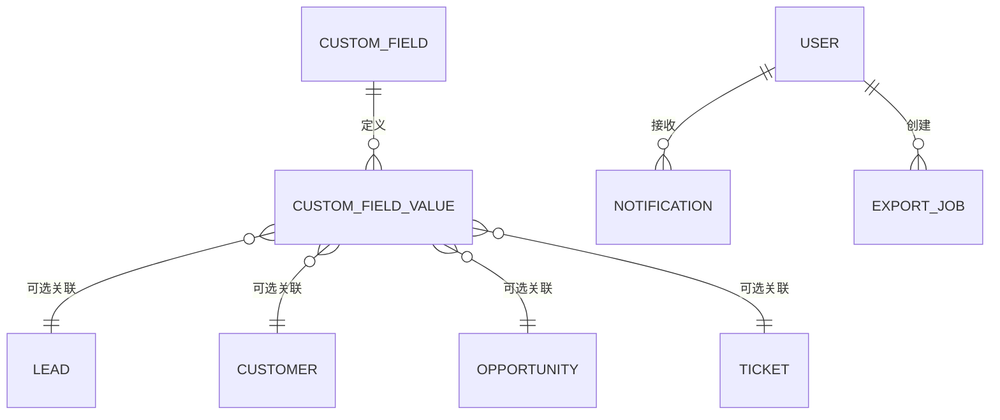

# 数据模型：系统增强模块

**Branch**: `016-system-enhancement` | **Date**: 2026-08-22

## 实体总览

## 1. custom_field（自定义字段定义）

| 列 | 类型 | 约束 | 说明 |
|---|---|---|---|
| id | BIGINT | PK, AUTO | |
| entity_type | VARCHAR(30) | NOT NULL | LEAD/CUSTOMER/OPPORTUNITY/TICKET |
| name | VARCHAR(50) | NOT NULL | 字段名称（实体内唯一） |
| field_type | VARCHAR(20) | NOT NULL | TEXT/TEXTAREA/NUMBER/DATE/SELECT |
| required | TINYINT | NOT NULL DEFAULT 0 | 必填 |
| options | VARCHAR(1000) | NULL | SELECT 选项（逗号分隔；其余类型为空） |
| enabled | TINYINT | NOT NULL DEFAULT 1 | 启用状态 |
| sort_order | INT | NOT NULL DEFAULT 0 | 排序 |
| deleted | TINYINT | NOT NULL DEFAULT 0 | 逻辑删除（BaseEntity） |
| version | INT | NOT NULL DEFAULT 0 | 乐观锁（BaseEntity） |
| created_by | BIGINT | NULL | （BaseEntity） |
| created_at | DATETIME | NOT NULL | （BaseEntity） |
| updated_at | DATETIME | NOT NULL | （BaseEntity） |

索引：`uk_field_entity_name`（entity_type, name, deleted）唯一；`idx_field_entity_enabled`（entity_type, enabled）。

## 2. custom_field_value（自定义字段值）

| 列 | 类型 | 约束 | 说明 |
|---|---|---|---|
| id | BIGINT | PK, AUTO | |
| field_id | BIGINT | NOT NULL, FK→custom_field | 字段定义 |
| entity_type | VARCHAR(30) | NOT NULL | LEAD/CUSTOMER/OPPORTUNITY/TICKET |
| entity_id | BIGINT | NOT NULL | 实体记录 id |
| field_value | VARCHAR(1000) | NULL | 字符串值 |
| created_at | DATETIME | NOT NULL | |

索引：`uk_field_entity_value`（field_id, entity_id）唯一；`idx_value_entity`（entity_type, entity_id）。

## 3. export_job（导出任务）

| 列 | 类型 | 约束 | 说明 |
|---|---|---|---|
| id | BIGINT | PK, AUTO | |
| export_type | VARCHAR(30) | NOT NULL | LEAD/CUSTOMER/OPPORTUNITY/TICKET |
| filter | TEXT | NULL | 筛选条件（JSON） |
| status | VARCHAR(20) | NOT NULL DEFAULT 'PENDING' | PENDING/RUNNING/DONE/FAILED |
| file_path | VARCHAR(500) | NULL | 生成文件路径 |
| row_count | BIGINT | NULL | 导出行数 |
| error_message | VARCHAR(1000) | NULL | 失败原因 |
| deleted | TINYINT | NOT NULL DEFAULT 0 | 逻辑删除（BaseEntity） |
| version | INT | NOT NULL DEFAULT 0 | 乐观锁（BaseEntity） |
| created_by | BIGINT | NULL | 创建人（BaseEntity） |
| created_at | DATETIME | NOT NULL | （BaseEntity） |
| updated_at | DATETIME | NOT NULL | （BaseEntity） |
| completed_at | DATETIME | NULL | 完成时间 |

索引：`idx_export_user`（created_by, created_at）。

## 4. notification（通知，替代 workflow_notification）

| 列 | 类型 | 约束 | 说明 |
|---|---|---|---|
| id | BIGINT | PK, AUTO | |
| user_id | BIGINT | NOT NULL, FK→user | 接收人 |
| type | VARCHAR(30) | NOT NULL | WORKFLOW/TICKET_ASSIGN/TICKET_REPLY |
| message | VARCHAR(500) | NOT NULL | 通知内容 |
| read | TINYINT | NOT NULL DEFAULT 0 | 已读 |
| entity_type | VARCHAR(30) | NULL | 关联实体类型 |
| entity_id | BIGINT | NULL | 关联实体 id |
| created_at | DATETIME | NOT NULL | |

索引：`idx_notif_user_read`（user_id, read）；`idx_notif_user_created`（user_id, created_at）。

## 枚举

- 字段适用实体 `FieldEntityType`: LEAD / CUSTOMER / OPPORTUNITY / TICKET
- 字段类型 `FieldType`: TEXT / TEXTAREA / NUMBER / DATE / SELECT
- 导出类型 `ExportType`: LEAD / CUSTOMER / OPPORTUNITY / TICKET
- 导出状态 `ExportStatus`: PENDING / RUNNING / DONE / FAILED
- 通知类型 `NotificationType`: WORKFLOW / TICKET_ASSIGN / TICKET_REPLY

## 数据清理策略

- 字段定义删除：物理删除关联 custom_field_value。
- 通知：每用户保留最近 100 条（创建时删除更旧记录）。
- 导出记录：每用户保留最近 50 条（创建时删除更旧记录）。
