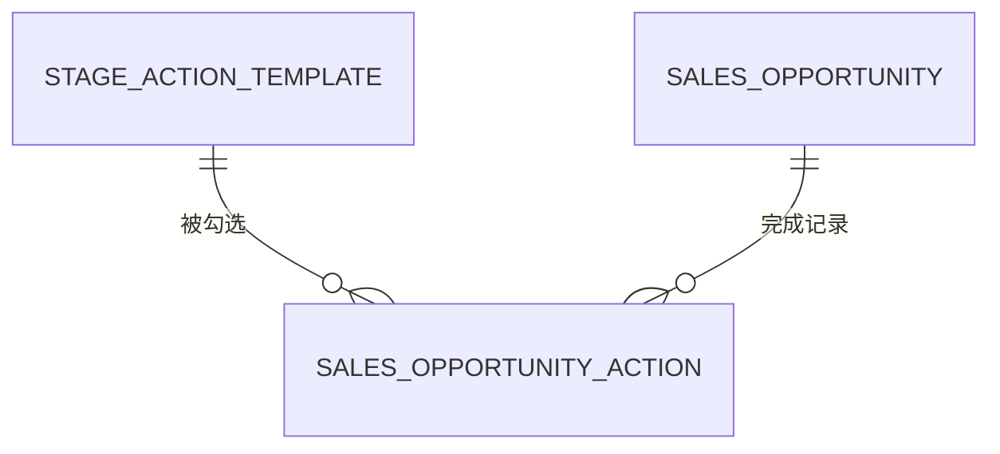

# 数据模型：销售 Playbook 模块

**Branch**: `045-sales-playbook` | **Date**: 2026-08-24

## 实体总览

## 1. stage_action_template（阶段动作模板）

| 列 | 类型 | 约束 | 说明 |
|---|---|---|---|
| id | BIGINT | PK, AUTO | |
| stage | VARCHAR(30) | NOT NULL | INITIAL_CONTACT/NEGOTIATING（仅活动阶段） |
| action_name | VARCHAR(100) | NOT NULL | 动作名称 |
| description | VARCHAR(500) | NULL | 动作描述 |
| sort_order | INT | NOT NULL DEFAULT 0 | 排序 |
| required | TINYINT | NOT NULL DEFAULT 0 | 必做 |
| enabled | TINYINT | NOT NULL DEFAULT 1 | 启用 |
| deleted | TINYINT | NOT NULL DEFAULT 0 | 逻辑删除（BaseEntity） |
| version | INT | NOT NULL DEFAULT 0 | 乐观锁（BaseEntity） |
| created_by | BIGINT | NULL | （BaseEntity） |
| created_at / updated_at | DATETIME | NOT NULL | （BaseEntity） |

索引：`idx_template_stage_enabled`（stage, enabled）、`idx_template_stage_sort`（stage, sort_order）。

## 2. sales_opportunity_action（销售机会动作完成）

| 列 | 类型 | 约束 | 说明 |
|---|---|---|---|
| id | BIGINT | PK, AUTO | |
| opportunity_id | BIGINT | NOT NULL, FK→sales_opportunity | 销售机会 |
| template_id | BIGINT | NOT NULL, FK→stage_action_template | 动作模板 |
| completed_by | BIGINT | NOT NULL | 完成人 |
| completed_at | DATETIME | NOT NULL | 完成时间 |

唯一约束：`uk_opp_action`（opportunity_id, template_id）——同一机会同一动作只完成一次。

## 枚举

- 阶段 `OpportunityStage`: INITIAL_CONTACT / NEGOTIATING / CLOSED_WON / CLOSED_LOST（沿用既有，不新增）

## 业务规则

- 模板仅对活动阶段（INITIAL_CONTACT/NEGOTIATING）可配置；终态阶段无动作引导。
- 模板逻辑删除；停用后新机会详情不展示，但已完成记录保留。
- 阶段流转（update/close）时前端校验当前阶段未完成必做项 → 提示可确认继续。
